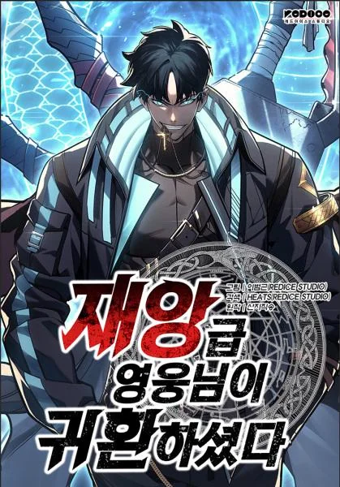

<html lang="fr">
<head>
    <meta charset="UTF-8" />
    <meta name="viewport" content="width=device-width, initial-scale=1" />
    <title>UnknownManga</title>
    <link rel="icon" type="image/site-1.icon" href="/site-1.icon" />
    <link rel="stylesheet" href="/css/styles.css" />
    
</head>
<body>

<header>
    
UnknownManga

    <nav>
        

            
            
            
        

        <ul class="nav-links" id="nav-links">
            <li><a href="Définition.html">Définition des mots</a></li>
            <li><a href="index.php">Accueil</a></li>
            <li><a href="Manga.html">Manga</a></li>
            <li><a href="Anime.html">Anime</a></li>
            <li><a href="Webtoon.html">Webtoon</a></li>
        </ul>
    </nav>

    

        <input type="search" id="search" class="barre" placeholder="Recherche" />
        <input type="button" id="button" onclick="ouvrirPage()" value="Chercher" class="bouton" />
    

    

        <button class="open-button" onclick="openForm()"><strong>Inscription/ Connexion</strong></button>
    

</header>

<!-- Popup Formulaire -->
<form method="GET" class="form-popup" id="popupForm" autocomplete="off">
    <label for="email" class="form-label">Email</label>
    <input type="email" class="form-control" id="email" name="email" aria-describedby="email-help" placeholder="you@exemple.com" required />
    
L'email utilisé lors de la création de compte.

    <label for="password" class="form-label">Mot de passe</label>
    <input type="password" class="form-control" id="password" name="password" required />

    <button type="submit" class="btn" name="ok">Envoyer</button>
    <button type="button" class="btn cancel" onclick="closeForm()">Fermer</button>
</form>

<!-- Section Héros -->
<section class="hero">
    

        <h1>Bienvenue sur UnknownManga</h1>
        
Votre source ultime pour tout ce qui concerne les mangas, anime et webtoons.

        <a href="Category.html" class="cta-button">Explorer les Catégories</a>
        <a href="discord.html" class="cta-button">Rejoins nous sur Discord</a>

        

            
            
            
        

    

</section>

<!-- Webtoon Carousel -->

    <h2>Webtoon</h2>
    

        <button class="arrow left" onclick="scrollCarousel('webtoon-carousel', -1)">&#10094;</button>
        

            
            
            
            
        

        <button class="arrow right" onclick="scrollCarousel('webtoon-carousel', 1)">&#10095;</button>
    

<!-- Manga Carousel -->

    <h2>Manga</h2>
    

        <button class="arrow left" onclick="scrollCarousel('manga-carousel', -1)">&#10094;</button>
        

            
            
            
            
        

        <button class="arrow right" onclick="scrollCarousel('manga-carousel', 1)">&#10095;</button>
    

<!-- Anime Carousel -->

    <h2>Anime</h2>
    

        <button class="arrow left" onclick="scrollCarousel('anime-carousel', -1)">&#10094;</button>
        

            
            
            
            
        

        <button class="arrow right" onclick="scrollCarousel('anime-carousel', 1)">&#10095;</button>
    

</body>
</html>
